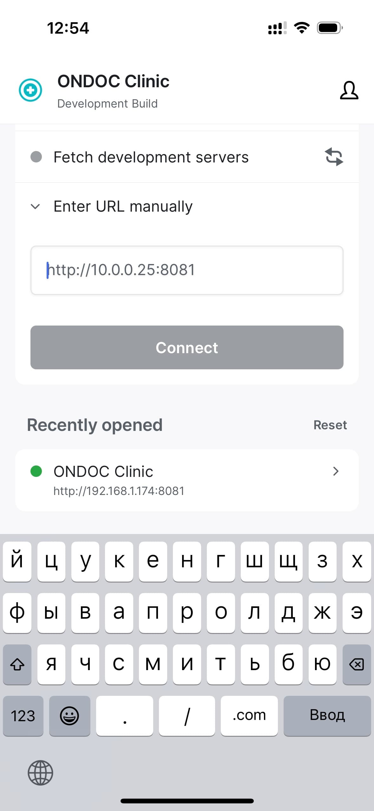

What should you do if you want to run and develop a React Native app, but you don't have macOS? Or if you don't want to install Xcode or Android Studio?

One solution is to use [Expo Go](https://expo.dev/go). It allows you to run a precompiled React Native app and serve only the JavaScript code from your local machine.

Expo Go comes bundled with many native libraries, so if you have a relatively standard app, it’s probably the best option.

But what if you still want to run an app that contains some custom native code or libraries not bundled with Expo Go?

Actually, it’s not that hard.

You will need a physical iPhone (for iOS) or Android device (for Android) and Expo EAS (or any other build server, although they are a bit more complicated to set up, so that’s beyond the scope of this article).

You need to follow this [link](https://expo.dev/eas) with instructions in case you don't have EAS installed.

I also recommend you to install [Expo Dev Client](https://docs.expo.dev/versions/latest/sdk/dev-client/), although it’s not necessary to run the app on your device, but it will make your life easier.

Your `eas.json` file should look like this:

```json
{
  "cli": {
    "version": ">= 0.52.0"
  },
  "build": {
    "development": {
      "distribution": "internal",
      "developmentClient": true,
      "android": {
        "gradleCommand": ":app:assembleDebug"
      },
      "ios": {
        "buildConfiguration": "Debug"
      }
    }
  }
}
```

Now you need to build your app using EAS:

```bash
eas build --platform ios --profile development
```

Run your local Metro server on your machine:

```bash
expo start --dev-client -m lan
```

Now run builded app on your device and open Dev tools (shake your device) and enter your machine's IP address in the "Enter URL manually" field.

[](../assets/eas.jpg)

And that's it!

You can change your code and see the changes in real time.
